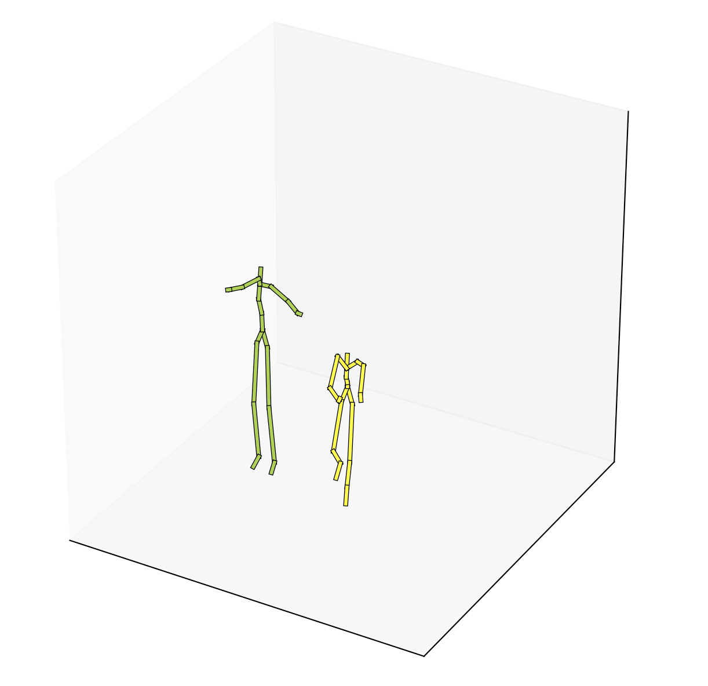

# Locomotion

## Install

```bash
git clone https://github.com/ErikEkstedt/Locomotion
```

1. `conda create -n maptask python=3`
    - [miniconda](https://conda.io/miniconda.html)
2. `source activate locomotion`
3. `pip install -r requirements.txt`


## Goal

Repo for trying out the [MOCAP dataset](https://bitbucket.org/jonathan-schwarz/edinburgh_locomotion_mocap_dataset/overview)



The dataset contains sequences of 63 based vectors. These values correlate to coordinates
in position and movement collected from real humans performing different movements. A
vector with 3 values are provided and defined as the control signal. This signal consists
of direction for certain reference points on an "agent".

This sequences were collected by recording sensors on real humans at 60 fps where each
sequence is 240 samples long, at 60 fps this means that the sequence encode 4 seconds in
time. At each step a coordinate vector of 63 values are provided along with the control at
that time step.

There are several way to use a sequence like this.

* **Treat entire sequence as a datapoint**. A 2d matrix with a time dimension and
  coordinate/control dimension. Not an autoregressive model but a model that generalizes
  over the entire dataset. A succesful generative model where `x \sim g_{theta}(z)` would
  provide movement through conditioned on the control. If the model is capable enough and
  the dataset explores sufficient volume of the coordination space possible given the
  degrees of fredom in the control signal then *the task is completed*, additional
  variables then needs to be introduced. However, the task to train a generative model
  that reaches the desired measure of capability is not a trivial task. At least not for
  the authors.
  - Train [Natural Discrete Representations](https://arxiv.org/pdf/1711.00937.pdf) Play around with different latent space dimensions.
    - [Van der Oord Blog](https://avdnoord.github.io/homepage/vqvae/),
  - Use a [Generative Flow model: Glow](https://arxiv.org/pdf/1807.03039.pdf)
    - [Glow Blog](Multi-Joint dynamics with Contact) 
* Train a model with a prior importance put on the sequential nature of the time dimension.
  **Train an autoregressive generative model.**
  - [Wavenet](https://arxiv.org/pdf/1609.03499.pdf)
* Add physics "penalties" for certain direction changes provided by the network. A useful
  - Sort of a pain (most probably) getting into quaterions.
  - Unneccesarry work. Check out [MuJoCo](http://www.mujoco.org/)(Multi-Joint dynamics with Contact)


## Table of Data

| Coordinates | Body part |
|:-----------:|:-----------:|
| 0-2 | Hip |
| 3-5 | Left Hip Joint |
| 6-8 | Left Knee |
| 9-11 | Left Heel |
| 12-14 | Left Toe |
| 15-17 | Right Hip Joint |
| 18-20 | Right Knee |
| 21-23 | Right Heel |
| 24-26 | Right Toe |
| 27-29 | Lower Back |
| 30-32 | Spine |
| 33-35 | Neck |
| 36-38 | Head |
| 39-41 | Left Shoulder |
| 42-44 | Left Elbow |
| 45-47 | Left Hand |
| 48-50 | Left Hand Index |
| 51-53 | Right Shoulder |
| 54-56 | Right Elbow |
| 57-59 | Right Hand |
| 60-62 | Right Hand Index |
| **Control** | **Direction** |
| 63 | Forward Velocity |
| 64 | Sideways Velocity |
| 65 | Rotational Velocity |

TODO:
* Cool and very helpful to visualize control signals along with coordinates during
  inference

```
@inproceedings{ikhansul17-vaelstm,
 author={Habibie, Ikhansul and Holden, Daniel and Schwarz, Jonathan and Yearsley, Joe and Komura, Taku},
 booktitle = {Proceedings of the British Machine Vision Conference ({BMVC})},
 title = {A Recurrent Variational Autoencoder for Human Motion Synthesis},
 year = {2017}
}
```
